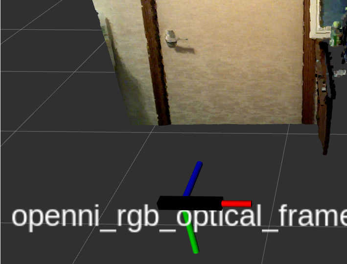

# xtion


## setup
```bash
# /your_ws/src
sudo apt update
rosdep install -i -y --from-path .
```
```bash
# /your_ws/
colcon build --symlink-install --packages-up-to xtion
```
```bash
sudo cp ./99-xtion-libusb.rules  /lib/udev/rules.d/
sudo udevadm trigger
```

## Execute
```bash
ros2 launch xtion camera.launch.py
```
sample preview
```bash
ros2 launch xtion camera.launch.py sample_view:=true
```
change namespace. default namespace is `camera` .
```bash
ros2 launch xtion camera.launch.py namespace:=camaera_name
```
